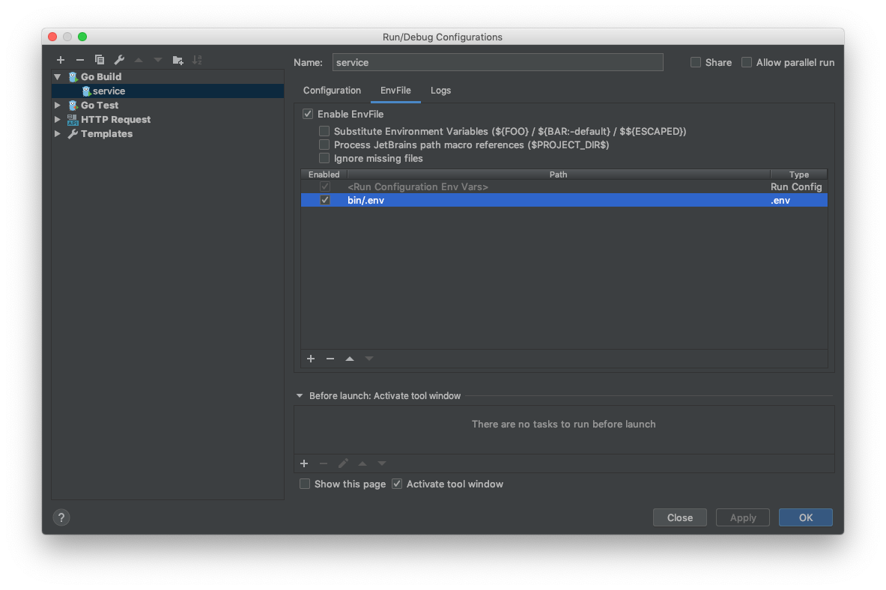

> # 🏋️‍♂️ lift
>
> Up your service locally.

[![Patreon][icon_patreon]](https://www.patreon.com/octolab)
[![License][icon_license]](LICENSE)

## Motivation

In [Avito](https://tech.avito.ru) we have an excellent PaaS which helps us to run our services in Kubernetes clusters
with just a few commands. But I want to run it so quickly and frequently as possible to debug during development.
For that reason, I need a possibility to up services written on Go locally from IDE like
[GoLand](https://www.jetbrains.com/go/) without losing the benefits that
[minikube](https://github.com/kubernetes/minikube) provides.

## The concept

```bash
$ eval $(lift up)
```

## How to

0. Describe your dependencies and storage in `app.toml`.

1. Define everything you need in `env_vars` and `envs.local.env_vars`. See [example](testdata/app.toml).

2. Dump environment variables into `.env` file

```bash
$ lift env > bin/.env
```

3. Use it in your IDE with [EnvFile](https://plugins.jetbrains.com/plugin/7861-envfile) plugin



4. Forward required ports using `kubectl port-forward`

  - or use my other tool named [forward](https://github.com/kamilsk/forward) for that

```bash
$ lift forward
forward -- demo-local-postgresql- 5432 demo-local-redis- 6379

$ eval $(lift forward)
```

5. or run all together

```bash
$ lift up
export SERVICE_A_URL="http://service-a.cluster/";
export SERVICE_C_URL="http://service-c.cluster/";
export SERVICE_B_URL="http://service-b.cluster/";
export PGHOST="localhost";
export PGPORT="5432";
export PGDATABASE="postgres";
export PGUSER="postgres";
export PGPASSWORD="";
export REDIS_PORT="6379";
export CUSTOM="variable";
forward -- demo-local-postgresql- 5432 demo-local-redis- 6379 &;
go run cmd/service/main.go;
ps | grep '[f]orward --' | awk '{print $1}' | xargs kill -SIGKILL

$ eval $(lift up)
```

## Installation

### Homebrew

```bash
$ brew install kamilsk/tap/lift
```

### Binary

```bash
$ REQ_VER=0.0.2  # all available versions are on https://github.com/kamilsk/lift/releases/
$ REQ_OS=Linux   # macOS is also available
$ REQ_ARCH=64bit # 32bit is also available
# wget -q -O lift.tar.gz
$ curl -sL -o lift.tar.gz \
       https://github.com/kamilsk/lift/releases/download/"${REQ_VER}/lift_${REQ_VER}_${REQ_OS}-${REQ_ARCH}".tar.gz
$ tar xf lift.tar.gz -C "${GOPATH}"/bin/ && rm lift.tar.gz
```

---

made with ❤️ for everyone

[icon_license]: https://img.shields.io/badge/license-MIT-blue.svg
[icon_patreon]: https://img.shields.io/badge/patreon-donate-orange.svg
